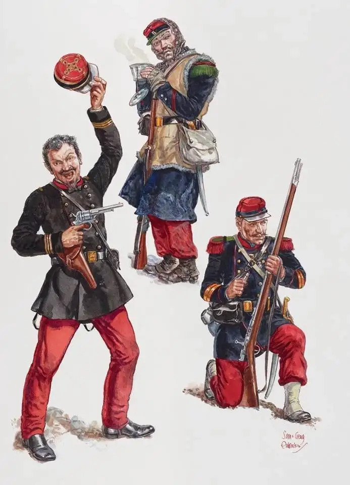
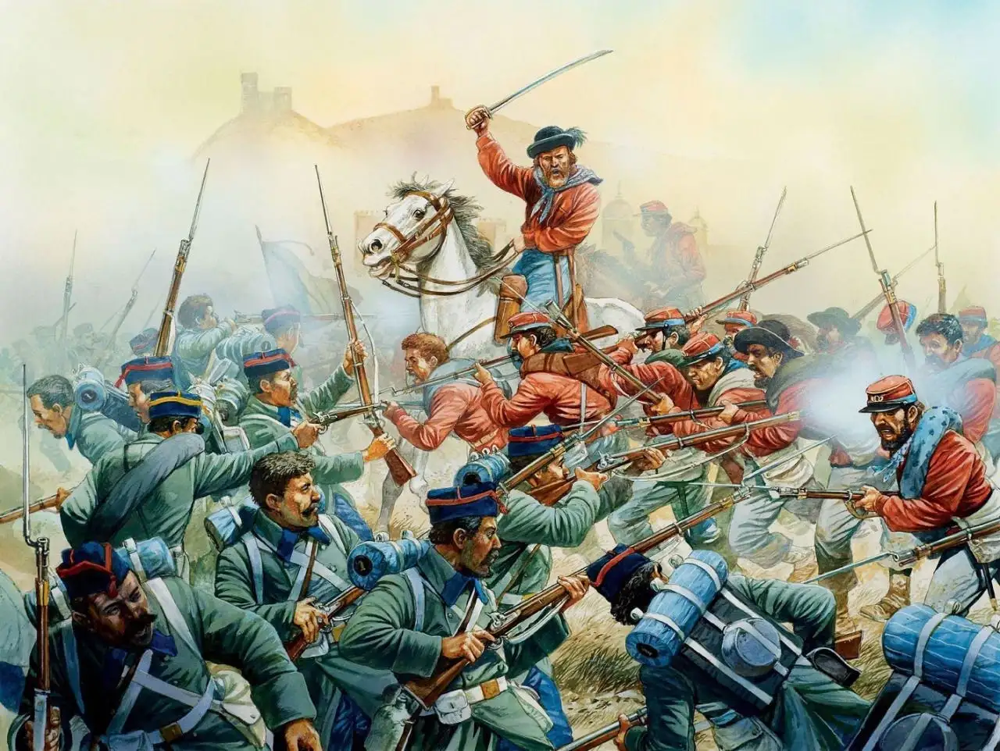
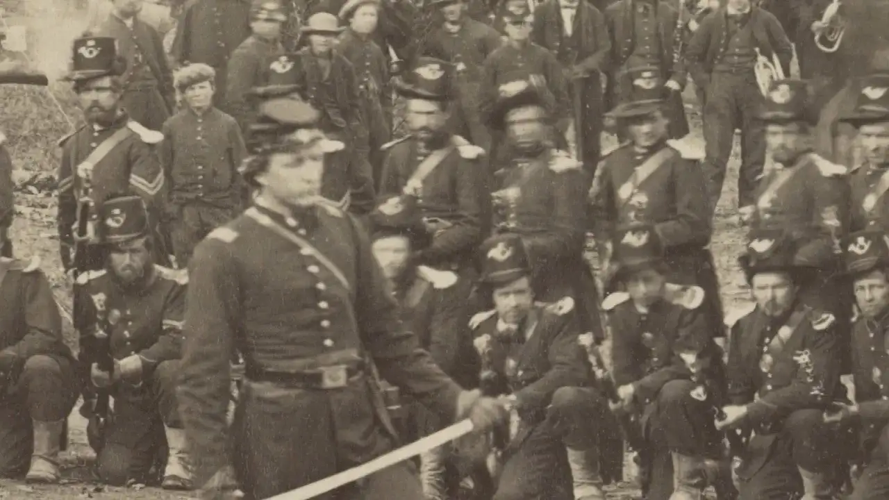
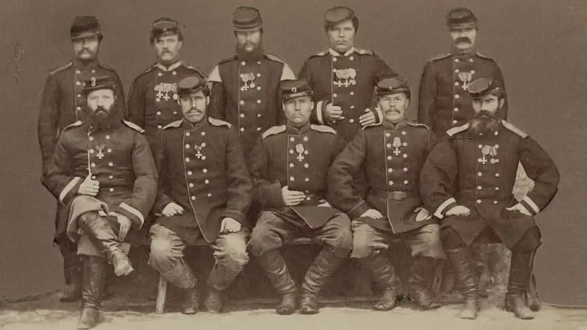

# А шапочка, извините, откуда?

Сегодняшняя «историческая угадайка» будет в графическом формате.

Вот несколько фотографий и изображений-реконструкций, демонстрирующих военную форму второй половины XIX в.

А кто изображен на этой фотографии?

Это русские воины, награждённые крестами за взятие Ташкента. 29 июня 1865 года отряд Черняева в 1300 человек взял этот крупнейший город Кокандского ханства.

Такое впечатление, что кепки для всех армий мира сшиты на одной и той же фабрике.

[Ссылка на Medium](https://yababay.medium.com/%D0%B0-%D1%88%D0%B0%D0%BF%D0%BE%D1%87%D0%BA%D0%B0-%D0%B8%D0%B7%D0%B2%D0%B8%D0%BD%D0%B8%D1%82%D0%B5-%D0%BE%D1%82%D0%BA%D1%83%D0%B4%D0%B0-91b56a3ea3b1)
