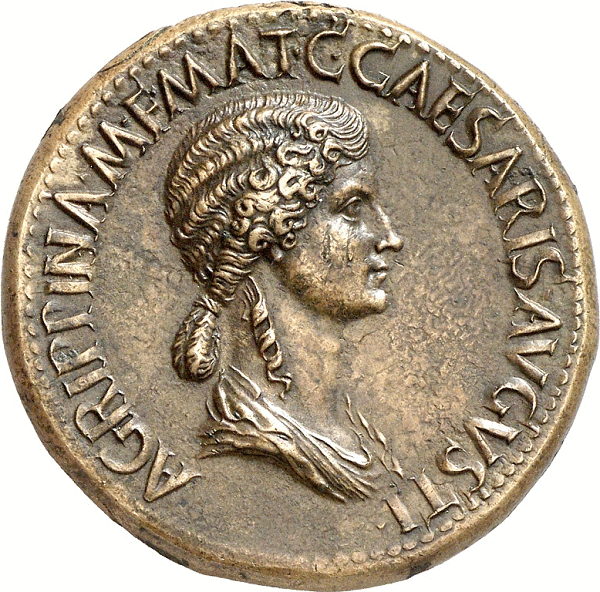

# …дык ёлы-палы, здравствуй, сестра!

В предыдущем материале неоднократно упоминается римская монета сестерций. Что можно было на нее купить? Я нашел англоязычный документ, где приводится такая справка:

* буханка хлеба — 0,5 сестерция;
* пол-литра вина — 1 сестерций;
* туника — 15 сестерциев;
* осел — 500 сестерциев;
* раб мужчина на аукционе — 6252 сестерция;
* рабыня девочка — 2400 сестерциев;
* годовая “зарплата” обычного легионера — 900 сестерциев.

Цены приведены на момент правления императора Траяна. Возможно, при более ранних императорах реальное наполнение сестерция было выше, т.к. постепенное обесценивание монеты характерно для любой эпохи.

Интересно, что сестерций не кратен базовой денежной единице. Он содержал 2,5 асса (sestertius так и принято переводить — “половина третьего”). В обращении находились также денарии (10 ассов), квинарии (5 ассов), но расчеты чаще производились в сестерциях, видимо, в связи с тем, что эта сумма приблизительно совпадала со средней дневной заработной платой.

Говоря о названии монеты, хотелось бы произвести его от слова “сестра”, поскольку изображение такой родственницы императора Августа — Агриппины Старшей — действительно чеканилось на древнеримских сестерциях. Но сестра на латыни — soror, хотя в большинстве индоевропейских языков это понятие обозначается словами, очень похожими на русское.

Кстати, на квинариях тоже можно встретить женские портреты, только уже не сестры, а супруги другого римского императора Септимия Севера — Юлии Домны. Не отсюда ли английское слово `queen`?

Вообще странно, что никому не приходит в голову простая мысль увязать слова «се-стер-ций» и «стер-линг». Варианты этимологии стерлинга — один экзотичнее другого, а ведь Британия была частью Римской империи, и сестерций там имел широкое хождение. Сестерций весил 1,14 г, стерлинг — 1,45 г. Разница для мира нумизматики существенная, но не критичная.

[К оглавлению](/#toc).

[Ссылка на Medium](https://yababay.medium.com/%D0%B4%D1%8B%D0%BA-%D1%91%D0%BB%D1%8B-%D0%BF%D0%B0%D0%BB%D1%8B-%D0%B7%D0%B4%D1%80%D0%B0%D0%B2%D1%81%D1%82%D0%B2%D1%83%D0%B9-%D1%81%D0%B5%D1%81%D1%82%D1%80%D0%B0-bb08d622f220)
