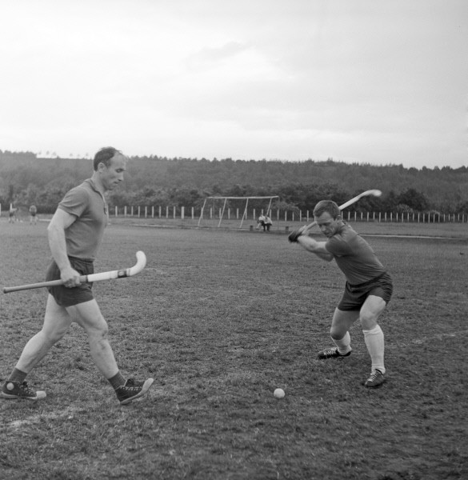

# Гусли и хоккей

[Один из моих любимых квновских номеров](https://www.youtube.com/watch?v=Dz-NhKo-Nhk) — об аудиоуроках по изучению русского языка по устаревшим шаблонам:

> — Феофан, ты идешь сегодня в баню? 
— Нет, Аксинья, сегодня я играю на гуслях.

Между тем гусли — не такой уж и древний инструмент. Читая биографию русского просветителя А.Т. Болотова (1738–1833), написанную  А.П. Бердышевым, я обнаружил, что в детстве выдающийся русский просветитель учился играть на них. Не потому, что хотел приобщиться к древнеславянскому музыкальному искусству. Просто гусли в ту пору были для ребенка, подростка примерно тем же, чем кассетный магнитофон в 1980-е, аудиоплеер в 2000-е или смартфон в наши дни — популярным устройством для воспроизведения музыки, повседневным музыкальным инструментом, и отправлять их во времена Бояна, Трояна и князя Игоря нет никакой необходимости. Об этом можно судить и по стихотворению времен Петра I “На горах Валдайских стоял Аполлон”, которое я [упоминал](/articles/na-gorah-valdajskih-hodil-apollon) в одном из недавних эссе.

Интересно, что наряду с таким древним увлечением, как игра на гуслях, было у мальчика из середины XVIII в. Андрюши Болотова и вполне современное — хоккей. Правда, тогда этот спорт назывался килкой, но популярен в северных губерниях России был даже больше, чем в наши дни. В ту пору люди не приходили на стадион, чтобы поболеть за команды, а сами участвовали в игре. Здесь не помешает объемная цитата:

> Много лет спустя, описывая свои детские годы, Андрей Тимофеевич вспомнит и эту увлекательную игру. «Случилось как-то мне увидеть, что ребятишки на дворе играли в так называемую килку. Мне игра сия полюбилась чрезвычайно, и более потому, что она имела некоторое подобие войны. Все играющие разделились на две партии, и одна партия старалась килку, или маленький и кругленький обрубочек от деревянного кола, гнать в одну сторону и догонять до конца двора или до уреченного какого-нибудь места, а другая партия старалась ей в том воспрепятствовать и гнать килку в другую сторону двора и также до какого-нибудь уреченного места, и которой партии удастсяпрежде до своего желания достигнуть, та и выигрывает… Чтобы удобнее можно было сию килку гнать, то каждый человек имел палку с кочерешкою на конце, дабы сею кочерешкою можно ему было килку и совать и по земле гнать, а ежели случится на просторе, то и ударять, чтобы летела далее и могли ее подхватить и гнать далее его товарищи… Словом, игра сия самая задорная, наполненная огня, рвения, усердия, и играющие должны употреблять наивозможнейшее проворство и скоропоспешнейшее бегание за килкою для успевания скорее ее ударить и прогнать, и притом наблюдается в ней некоторый порядок”. Андрей Тимофеевич правильно уловил основные эмоциональные признаки игры. В его описании мы находим упоминание о таких особенностях, которые в наши дни, к сожалению, утрачены. Имеются в виду массовость игры и участие в ней не только подростков, но и взрослых. “Впрочем, была игра сия у нас в деревне в таком тогда обыкновении, что в зимнее досужее вечернее время игрывали в нее не только ребятишки, но и самые старые и взрослые люди вместе с ними. Всякий выбирал другого такого ж себе в соперники, и все не меньше бегали и проворили, как и ребятишки, и веселились до крайности, когда случалось победить и заставить себя побежденному перенесть за плечами через весь двор или от одного уреченпого места до другого».

От себя биограф замечает:

> Вспоминая свои детские годы, я могу подтвердить, что и в те времена в лапту, в бабки играло все взрослое мужское население деревни, (за исключением разве уж самых дряхлых стариков). Любо-дорого было смотреть, как с развевающейся бородой мчится крестьянин, убегая от сына, а то и от внука, владеющего мячом.

Я в свою очередь добавлю, что одним из самых ярких воспоминаний моей мамы (1944 г.р.) о ее детстве, которое прошло в Калининской, ныне Тверской, области, стала игра в лапту. Этим спортом страстно увлекались все ее сверстники. Я такого уже не застал. Наше поколение росло уже преимущественно в городах, в деревню приезжали только на несколько летних недель и сдружиться толком не успевали. Наш удел — «12 палочек» — разновидность пряток, не требующая особого спортивного мастерства и инвентаря. Но сейчас нет и этого.

Вернемся к килке. В нее играли не по раз и навсегда установленным правилам, допускались импровизации:

> Однажды во время игры произошел несчастный случай: резко брошенная килка угодила в лицо одному из игроков и сильно рассекла губы и подбородок. Андрюша не оставил этот случай без внимания, и по его совету деревянный кругляш был заменен кожаным мячом.

Гонять изогнутыми клюшками кожаный мяч по лужайке? Это же современный хоккей на траве в чистом виде.

Трудно не согласиться с выводом А.П. Бердышева:

> Приведенные цитаты дают нам совершенно четкое представление о том, что килка — эта русская народная игра XVIII в.- несомненный предшественник современного хоккея. Все главные атрибуты хоккея — клюшка, шайба, мяч — уже имеются в килке, и от нее до всех видов хоккея, что называется, «рукой подать». В самом деле, что для этого понадобилось в будущем? Снежную площадку заменить ледяной, игроков водрузить на коньки а вместо «уреченного» места поставить ворота.

Думаю, слово «килка» — так называлась «шайба» старинного «хоккея» — происходит от слова «кила», т.е. нарост. Похоже, изначально в этом качестве могли использоваться наросты со стволов деревьев (грибы) имеющие подходящие размеры, форму, и мягкость. Клюшка же называлась смешным словом кочережка, в котором можно легко рассмотреть общеевропейскую приставку “ко-” (кооперация), часто переходящую в “со-” (сочленение) и корень “черен” (черенок, черешня, черёмуха). Кочережка — место, от которого растет черен, т.е. часть корня со стволом. Поскольку северные березы славятся своей изогнутостью (а детство А.Т. Болотова проходило на Псковщине), клюшку легко было сделать из целикового деревца.

Кроме гуслей и хоккея было в те времена в России много других блестящих достижений человеческого ума и труда:

> <Помещик> держал в имении кузнецов, столяров, токарей, кожевников, причем старался отыскать не просто ремесленника, а мастера высокого класса, способного сделать уникальную вещь, с художественным вкусом. Так, например, у него был старичок, занимавшийся поделкой различных коробок, шкатулок, табакерок и т.п. из бересты. Подбирая соответствующее сырье и применяя особые способы отделки, этот старичок делал шедевры оригинального промысла, пользовавшиеся большим спросом. Андрюша, увидевший эти изделия, загорелся желанием научиться делать такие же и уговорил мастера взять его к себе в ученики. Старичок, обнаружив интерес и старание мальчика, не только обучил его своему уникальному мастерству, но и подарил ему набор инструментов собственного изготовления. Обрадованный Андрюша изготовил для учителя шкатулку, украшенную орнаментом, придуманным им самим. Теперь, имея инструмент, он мог заниматься интересным делом в любое время. Учился Андрюша и другим видам ремесел, в частности токарному.

Получается, что «классовая борьба» еще не была в середине XVIII в. такой уж свирепой. Дети земледельцев и помещиков вместе росли и играли. Крестьяне даже могли научить кое-чему своих лендлордов. Я, конечно, не апологет крепостного права, но примеры не борьбы, а сотрудничества сословий в жизнеописании Андрея Болотова встречаются:

> …доброму старичку <не тому, который делал берестяные коробочки, а другому, садоводу> решился я препоручить все сады мои в смотрение. И сей-то прежний служитель отца моего, которого на старости мы женили и выпустили было в крестьяне, но взяли опять во двор, был и садовником моим, и помощником, и советником, и всем, всем. И хотя сначала и оба мы из относящегося до садов не знали, но иностранные книги обоих нас в короткое время так всему научили, что он вскоре сделался таким садовником, какого я не желал лучше. И он пришелся прямо ко мне и по моим мыслям; ибо не только охотно исполнял все мною затеваемое и ему повелеваемое, но и по замысловатости своей старался еще предузнавать мои мысли и предупреждать самые хотения мои, чем наиболее и сделался мне приятным. И я могу сказать, что все прежние мои сады разными насаждениями своими и всем образованием [созданием] своим обязаны сему человеку. Его рука садила все старинные деревья, и воспитывала, и обрезывала их; и его ум обработал многие в них места, видимые еще и поныне и служащие мне памятником его прилежности и трудолюбия. Словом, я был сим служителем своим, дожившим до глубокой старости и трудившимся в садах моих до последнего остатка сил своих, так много доволен, что и поныне, при воспоминании его и того, как мы с ним тогда живали, как все выдумывали и затеи свои приводили в действо, слеза навертывается на глазах моих, и я, благословляя прах его, желаю ему вечного покоя.

Складывается впечатление, что крестьяне относились к дворянам как к неразумным детям, которые, если их предоставить самим себе, наделают глупостей. Примеры такого «высокомерного» отношения крестьян к своим «хозяевам» мне доводилось встречать в источниках не раз. Да что далеко ходить, Архип Савельевич из »Капитанской дочки» очень часто действует по своему усмотрению, спорит с барином и знает экономическое состояние имения лучше, чем сами помещики.

Таким образом, постпетровская Россия была населена людьми всё еще вольными (крестьяне еще не ощутили всей тяжести крепостничества), развитыми физически и умственно, здоровыми. В стране было много мастеров, ремёсел, причем не насаженных сверху Петром и его последователями, а исконных, народных. Стремление к образованию и науке сквозит через всё повествование А.Т. Болотова о своей жизни… Куда всё это ушло?

[К оглавлению](/#toc).

[Ссылка на Medium](https://yababay.medium.com/%D0%B3%D1%83%D1%81%D0%BB%D0%B8-%D0%B8-%D1%85%D0%BE%D0%BA%D0%BA%D0%B5%D0%B9-b728807eb154)
