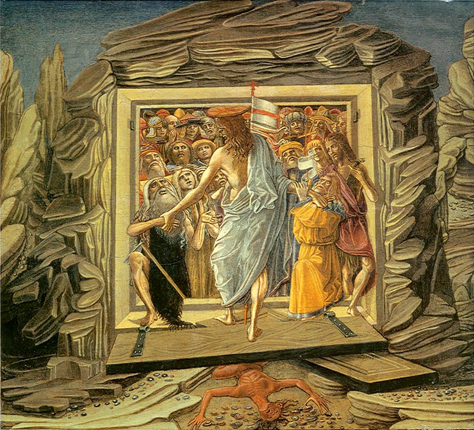

# Из истории идолищ поганых

Ниспровержение языческих идолов князем Владимиром — одно из ключевых событий официальной российской истории. Из написанного об этом на меня наибольшее впечатление произвела строчка из песни БГ: 

> А всё равно Владимир гонит стадо к реке,
> А стаду всё равно, его съели с г...м. 

Её, однако, можно отнести к историческим источникам не без некоторой натяжки, поэтому в этом эссе присмотримся к более традиционным текстам.

Точку зрения Русской Православной церкви на христианизацию наших диких краёв можно уяснить из книги А.Н. Муравьева «Русская Фивиада на Севере». Он пишет, например, о святителе Стефане Пермском, жившем во второй половине XIV в.:

> С посохом странника и с верой Апостола идет он проповедовать слово Божие на устье Выми и Вычегды, и вверх, по течению сих рек, поднимается его проповедь в дикую Пермь. Он сокрушает идолов, смиряет волхвов языческих и покоряет целые народы свету Христову, потом идет в Москву просить Епископа по новопросвещеному краю, и сам, по праву, туда возвращается первым Епископом.

Удивительно, что со времени крещения Новгорода прошло уже столько времени, а на подконтрольной этому городу-государству территории люди всё еще поклоняются идолам. Казалось бы, еще в XI в. последние волхвы на Белоозере смирились перед властью христианских князей. Но и спустя треть тысячелетия деятельность Стефана Пермского сравнивается с апостольской: он, судя по процитированному, стал первым, кто принес жителям побережья Выми и Вычегды знание о христианстве. А ведь Вычегда впадает в Северную Двину, на берега которой христианство пришло не позднее XII в.: подвластные Новгороду Холмогоры упоминаются с 1138 г.

В книге Д.И. Иловайского «Собиратели Руси» находим интересные подробности о миссионерской деятельности Стефана Пермского:

> Стефан избрал местом своей проповеди ближайший к его родине Зырянский край, именно берега Вычегды. Край этот в прежнее время платил дани Новгороду, а теперь переходил уже в Московскую зависимость. Местопребывание свое Стефан утвердил в главном и притом довольно торговом селении Усть-Выми, т.е. при впадении Выми (с правой стороны) в Вычегду. Проповедь его здесь была успешна, и он вскоре для новообращенной паствы построил церковь во имя Благовещения. Эта церковь своею красотою немало привлекала туземцев, которые невольно предпочитали ее языческим кумирам с их безобразными идолами. А богослужение, чтение священных книг и пение псалмов на понятном им народном языке еще более располагали их в пользу новой веры. Стефан со своими учениками обходил леса и распутия и ревностно истреблял попадавшихся ему многочисленных идолов. Кроме многих мелких кумиров, в сей стране встречались и некоторые большие деревянные истуканы, к которым на поклонение приходили язычники издалека и приносили им в дар шкуры соболей, куниц, горностаев, бобров, медведей, лисиц и белок; все это развешивали они на самого идола или вокруг него. Стефан обыкновенно ударял идола сначала обухом в лоб и повергал на землю, а потом раскалывал его топором на малые поленья, и бросал в зажженный костер; туда же бросал и все найденные при нем шкуры. Пермяне с удивлением смотрели на проповедника, который не соблазнялся дорогими мехами и не брал их себе, а сожигал в огне.

Вот такая бескомпромиссная идеологическая борьба. Впрочем, несмотря на усилия миссионеров, полным успехом она так и не увенчалась. Язычество во всю бытовало, например, в Поволжьи еще и в начале XX века: во время главных своих праздников местные запирали православных священнослужителей в каком-нибудь погребе, а сами веселились всю ночь самым непотребным, зато соответствующим древним обычаям образом. О несколько затянувшейся (занявшей целую 1000 лет), да так и не доведенной до конца христианизации Руси/России много писал покойный А.В. Пыжиков.

Чем же так не угодили языческие идолы христианам? Пусть бы себе сосуществовали с новыми религиозными веяниями и были бы побеждены в честном соперничестве… Отнюдь! Если считать христианство религией, проповедующей всеобщее братство, а значит и отказ от рабовладения, то бороться было с чем. Языческие идолы были не так безобидны, как иногда пытаются их представить адепты неоязычества и прочие романтические натуры. Вот что пишет арабский путешественник первой половины X в. Ахмад ибн Фадлан о том, что происходило в его время на т.н. Булгарском торжище, близ слияния Волги с Камой:

> Как только корабли русов прибывают к месту стоянки, каждый рус выходит с хлебом, мясом, луком, молоком и брагой, подходит к вертикально поставленному длинному бревну с лицом, похожим на лицо человека; вокруг этого бревна меньшие идолы, а за этими идолами — длинные бревна, вертикально вкопанные в землю. Он подходит к большому идолу и кланяется ему, затем говорит ему: «Господи! Я приехал из далекой страны, у меня рабынь столько-то и столько-то голов, соболей столько-то и столько-то шкур», — так он описывает все товары, прибывшие с ним, затем говорит: «И я пришел к тебе с этим даром!». Он оставляет принесенный дар перед этим бревном и говорит: «Я хочу, чтобы Ты ниспослал мне купца с многочисленными динарами и дирхамами и чтобы он купил у меня все, что я захочу, и не прекословил бы мне в том, что я скажу!» Затем он уходит. Если у этого [руса] трудности с продажей и время его пребывания затягивается, он приходит с даром во второй и в третий раз. Если у него по-прежнему затруднения в том, что он хочет, он приносит дары каждому из меньших идолов, просит их о заступничестве и говорит: «Это жены, дочери и сыновья нашего господа!» Он не перестает обращаться к этим идолам одному за другим, прося и моля их о заступничестве и пресмыкаясь перед ними. Бывает, что продажа идет легко и он распродает все, что привез. Тогда он говорит: «Мой господь исполнил мою нужду и мне следует вознаградить его!» Он берет несколько овец или коров, убивает их, раздает часть мяса, а оставшееся приносит и бросает перед большим и окружающими его меньшими идолами, а головы убитых коров или овец вешает на вертикально вкопанные в землю бревна. Когда наступает ночь, прибегают собаки и съедают все это. И говорит принесший жертву: «Мой господь доволен мной: он съел мой дар!».

Оказывается, языческие божества, олицетворенные в виде идолов, «обслуживали» не всех без разбору жителей Восточно-Европейской равнины, а преимущественно работорговцев. Зачем мне понадобилось такое сложное словосочетание? Почему не написал «русские» или «славяне», а назвал тогдашних обитателей нынешней российской территории «жителями Восточно-Европейской равнины»? Да потому что русские и славяне в то время были разными народами! И не просто соседями. Об их взаимоотношениях тот же ибн Фалдан пишет так:

> Рӯсы совершают военные походы против славян. Они путешествуют на кораблях, до тех пор пока им не захочется взять в плен каких-нибудь славян. Они выходят на берег, угоняют пленных в Хазарāн и Булгāр и там многих из них продают. У них нет пахотных земель, они питаются только тем, что привозят из земли славян. Когда у какого-нибудь мужчины-рӯса рождается сын, он подходит к новорожденному с обнаженным мечом, кладет его младенцу на руки и говорит: «Я не оставлю тебе в наследство денег, у тебя будет только то, что ты сам добудешь этим своим мечом». У рӯсов нет постоянного имущества, деревень и пахотных земель. Поистине, единственным их занятием является торговля…

Мы, значит, уже который век татаро-монгольское иго проклинаем, а тут вон оно чё: русы совершают военные походы против славян, регулярно и без счета угоняют их в рабство с целью продажи… В этом свете многие странности отечественной истории становятся понятными. Например, исследователь русской речной торговли А. Рагунштейн пишет в книге «За три моря за зипунами»:

> Путь из Москвы на Волгу лежал через Дмитров, от него товары переправлялись по рекам Дубне и Сестре непосредственно на Волгу. Из русских городов наибольшее значение на этом пути имели Холопий городок, Ярославль, Кострома, Балахна и Нижний Новгород. В Холопьем городке была большая ярмарка, куда свозили товары как русские купцы, так и гости из стран Востока. Однако главным торговым центром волжской торговли стал Нижний Новгород…

Кто в здравом уме поедет нынче по воде из Москвы на Волгу через Дмитров, если можно спокойно спуститься по Москве-реке до Оки, и уже по ней добраться до Нижнего Новгорода? Ведь маршрут через Верхнюю Волгу изобилует мелководьями, волоками и прочими неудобствами. Да потому, что сначала нужно было непременно заехать в Холопий городок, который назван так отнюдь неспроста, и взять на борт груз, дающий самую большую прибыль. Сейчас это место затоплено (и, похоже, не только по техническим причинам) Рыбинским водохранилищем. Еще не так давно, в XIX — начале XX вв. оно называлось Мологским краем, по названию тамошних реки и города. В более же ранние времена там находился один из крупнейших, если не крупнейший в Европе рынков рабов. М.Г. Худяков в «Очерках по истории Казанского ханства» пишет без обиняков:

> Особую отрасль казанской торговли составляла торговля рабами. Предметом работорговли служили главным образом пленные, в особенности женщины, которые находили сбыт в гаремы всех стран, расположенных вокруг Каспийского моря. Внутри России работорговля также существовала, и по всей вероятности не случайно место, где происходила ярмарка восточных купцов, получило название Холопьего города, т.е. города рабов или города, где торгуют рабами. Составитель «Казанского Летописца» говорит: что казанцы «приводяще к себе русь пленную… яко скот толпами привязанных держаху и на торгу продаваху иноязычным купцам» — «продаваша мирский полон в дальние срачины (сарацины, т. е. мусульмане), им и выйти не могуще». В 1521 году, по сообщению Герберштейна «Саип Гирей, царь казанский, продал татарам всех пленников, которых увел из Московии, на астраханском рынке». Русское правительство постоянно боролось с торговлей военнопленными на невольничьих рынках и в 1551 году добилось формальной отмены христианского рабства и освобождения пленных рабов.

Речь идет, между прочим, идет уже о XVI веке, а «христианское рабство» еще только пытаются запретить. Так может до той поры и стояли по берегам Волги идолы, которым усердные работорговцы молились в надежде на встречу с богатым восточным перекупщиком? Может и место то неспроста назвали Казанью, поскольку там показывали живой товар, прежде чем направить его вниз по течению?

Всё это домыслы, конечно, но фактов о том, что волжская работорговля до поры до времени процветала, историки сообщают множество. Взять хоть тех же ушкуйников, которых в художественной литературе изображают эдакими героями истернов, удальцами, бороздящими речные просторы в стремлении разжиться зипунами. Но зипун — одежда простонародья, удальцу-молодцу носить ее не пристало. А вот если предположить, что речных разбойников интересовали не сами зипуны, а те, кто носит такую одежду — неосторожно отошедшие от жилья чуть дальше чем следовало простолюдины, то всё становится на свои места: походы за зипунами — эта охота на рабов. Вот, например, как описывает А. Рагунштейн один из походов ушкуйников:

> От Костромы ушкуйники пришли к Нижнему Новгороду, сожгли город и перебили местных жителей, взяв некоторых в плен. Затем двинулись далее, вниз по течению Волги и поднялись вверх по Каме. Разграбив прикамские земли, они снова вернулись на Волгу и достигли Булгара (Казани), где продали захваченных пленников в рабство. Облегчившись от груза, ушкуйники двинулись далее вниз по реке к Сараю, грабя по дороге русских гостей. Всех захваченных в плен купцов они также продали в рабство в Астрахани.

В общем, древнерусская история густо замешана на работорговле, причем предметом купли-продажи становились не люди чуждой расы, которых «не жалко», а свои же, белые. Именно игнорирование этого ключевого обстоятельства делает отечественную историю такой «запутанной» и «темной». Христианство как «профсоюз рабов» боролось с идолопоклонниками не потому, что обряды язычников казались приверженцам новой религии неприемлемыми, а потому, что идолопоклонники не считали рабство противоестественным и представляли собой смертельную опасность для людей, веровавших в Спасителя. Ведь рассказ о том, как воскресший Христос вывел праведников из ада, может иметь под собой вполне реальную основу: христиане освобождали своих единоверцев из плена всеми доступными способами, от вооруженных рейдов до выкупов. Возможно даже, что за этим евангельским сюжетом кроется конкретный случай освобождения рабов, пожизненно запертых в каких-то нечеловеческих условиях (на рудниках, на металлургических заводах).

Припоминается и Солон, который дал свободу порабощенным согражданам:

> Моей свидетельницей пред судом времен
> Да будет черная земля, святая мать
> Богов небесных! Я убрал с нее позор
> Повсюду водруженных по межам столбов.
> Была земля рабыней, стала вольною.
> И многих в стены богозданной родины
> Вернул афинян, проданных в полон чужой
> Кто правосудно, кто неправдой. Я домой
> Привел скитальцев, беглецов, укрывшихся
> От долга неоплатного, родную речь
> Забывших средь скитаний по чужим краям.
> Другим, что здесь меж ними, обнищалые,
> В постыдном рабстве жили, трепеща владык,
> Игралища их прихотей, свободу дал.

Древнегреческий реформатор запомнился тем, что, как и Стефан Пермский, устранил какие-то столбы с лица земли. Может, межевые, а может и обслуживавших работорговцев деревянных истуканов, подобных тем, о которых пишет ибн Фалдан. И если хронология действительно искажена и искусственно удлинена, то, возможно, реформы Солона отстоят не так уж далеко во времени от ниспровержения языческих идолов на Руси.

[Ссылка на Medium](https://yababay.medium.com/%D0%B8%D0%B7-%D0%B8%D1%81%D1%82%D0%BE%D1%80%D0%B8%D0%B8-%D0%B8%D0%B4%D0%BE%D0%BB%D0%B8%D1%89-%D0%BF%D0%BE%D0%B3%D0%B0%D0%BD%D1%8B%D1%85-b4042ca3ccf6)

[К оглавлению](/#toc).
