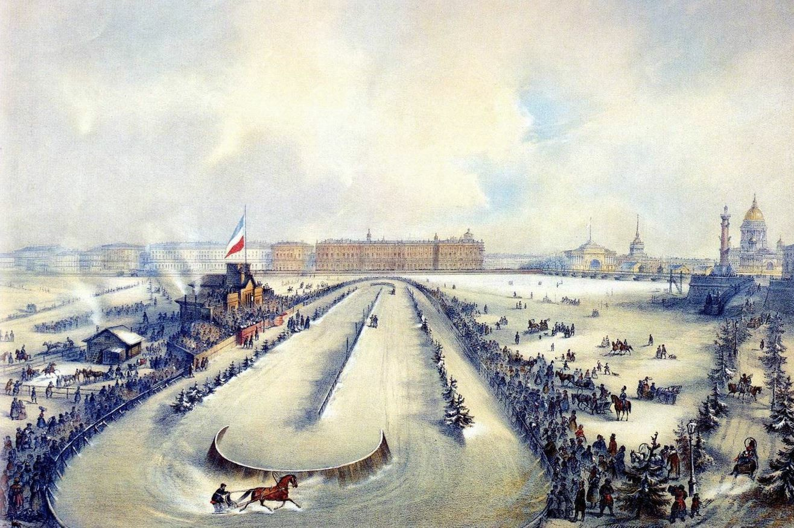

# Конный гладиатор

А действительно, почему во время римских зрелищ не показывали конных поединков? Ведь всё необходимое для этого было в наличии.

Кровавые римские представления для публики, проходившие на стадионах вроде Колизея, отличались не только красочностью, но и сложными технологиями. Гладиаторы были облачены в доспехи, изготовить которые и по нынешним временам не самая простая задача. Под сценой находились затейливые машины, с помощью которых производились всевозможные спецэффекты. Устраивались даже полноценные морские сражения на рукотворных водоемах, инсценировки штурма Трои с сотнями участников, стенами, осадными орудиями. Не было недостатка и в экзотических животных, которых свозили для представлений со всех концов Империи.

Римлянам было не чуждо использование лошадей. Неотъемлемой частью вышеупомянутых зрелищ были состязания колесниц, впряженных в повозки довольно сложной конструкции (уж турнирные копья и подавно могли изготавливать). О том же свидетельствует и наличие целого сословия — всадников. Правда, это были очень странные всадники. Нигде не доводилось мне читать о том, как они в конном строю одерживали славные боевые победы. Зато эти эквиты (equites, от лат. equus — «конь») были неизменными участниками придворных интриг и политических игр. Даже официальные историки не вполне уверенно могут объяснить, почему эта прослойка римской аристократии так называлась. Но хоть римские всадники это и не римская конница, но конница-то у римлян была вполне развита. А вот до конных прилюдных поединков римляне не додумались.

Как же получилось, что римляне не додумались до простого, но очень эффектного зрелища: два всадника садятся на коней и мчатся навстречу друг другу с копьями наперевес? Чего уж проще: кто выбьет из седла соперника, тот и победил. Для этого и нужно-то всего две лошади, да две крепкие длинные палки, изготовить которые можно за 15 минут из стволов чуть ли не первых попавшихся молодых деревьев. Ведь это так естественно. Даже в деревенских стычках первое, что делают драчуны — «хватаются за колья», это выражение даже можно назвать устойчивым. Отец рассказывал мне, что один из его дядьев был заводилой в таких делах, и если парни из соседней деревни появлялись в округе с агрессивными намерениями, он «садился на своего вороного коня Графика, выламывал кол из ближайшего забора, и мчался на чужих». Вот и вся нехитрая подноготная рыцарских турниров.

Додумались до этого, почему-то, лишь спустя века средневековые рыцари, которые, в отличие от римских всадников, и при королевских дворах заседали, и конными участвовали в реальных боях. Самое популярное публичное состязание Средневековья, как мы все знаем, — рыцарский турнир, на котором как раз и съезжались попарно воины с намерением вышибить друг друга из седла специальными 3-метровыми (или даже более длинными) копьями-кольями. Что интересно, если оба соперника оказывались сброшенными на землю, то они начинали биться самым обыкновенным холодным оружием: мечами, топорами, ножами. В этот момент они ничем не отличались от римских гладиаторов, в том числе и тем, что бились насмерть, и что зрители и император (или король) могли влиять на исход сражения.

О других видах средневековых поединков нам историки рассказывают скупо. Практиковались, правда, «Божьи суды» — когда поссорившиеся обыватели дрались пешими холодным оружием или просто на кулаках, причем и на Руси такие были распространены, да еще и до довольно поздних времен. Вспомним «Песню о купце Калашникове» М.Ю. Лермонтова или «Соборное уложение» 1649 г., в котором поединки «в поле» всё ещё упоминаются и регулируются. Да что там XVI, XVII вв., если и во времена Петра I представители московской знати все еще вызывали друг друга биться «на кулачках». Даже в XIX в. постановочные битвы стенка на стенку ради потехи не были редкостью, хотя исходы в таких столкновениях случались порой и совсем не потешные. Подробности можно почитать у Н.С. Лескова в рассказе «Грабеж».

В общем, по-моему древнеримские зрелища с гладиаторами, средневековые турниры и русские кулачные бои (а также дворянские дуэли и современные спортивные единоборства) — это звенья непрерывной цепи, которую официальная историческая наука норовит разорвать и удлинить всевозможными «тёмными веками». В очередной раз нас пытаются убедить, что сложное (римские зрелища) появилось раньше простого (драка первыми попавшимися палками).

Ну, и в заключение — две картинки:

[Ссылка на Medium](https://yababay.medium.com/%D0%BA%D0%BE%D0%BD%D0%BD%D1%8B%D0%B9-%D0%B3%D0%BB%D0%B0%D0%B4%D0%B8%D0%B0%D1%82%D0%BE%D1%80-7ef58c033d2f)

