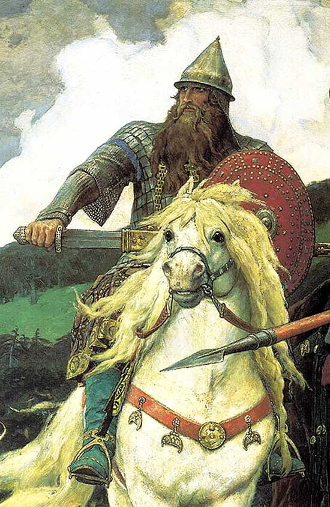
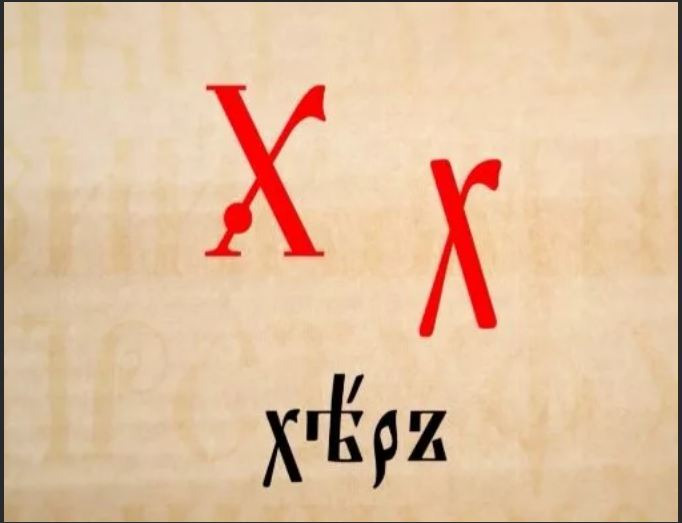

# Смеяться после слова «лопата»

*Возрастное ограничение 16+*

Альтернативный историк [Олег Павлюченко](https://www.youtube.com/@aispik4290/about) свои представления о возможном прошлом человечества связывает со словом «хер». Оно, по его мнению, лежит в основе многих базовых политических терминов и проливает свет на устройство древних обществ. Я этого мнения не разделяю. Лингвистические фокусы - одно из самых уязвимых мест альтернативных теорий для критики официальной наукой. На этом «погорели» Фоменко и Носовский, возможно, даже, целенаправленно, чтобы прикрыть слишком широко распахнутую дверцу... И все-таки поиграть со словами иногда очень соблазнительно. Можно рассматривать «народную этимологию» в качестве своеобразного развлечения. Не даром один из самых больших любителей этого дела - М.М. Задорнов - был по основному роду своей деятельности писателем-юмористом. Вот и я на днях из одного лингвистического факта вывел целую цепочку забавных аллюзий.

Оттолкнемся от клички одного из рыцарей, фигурирующих в сказаниях о короле  Артуре - Парцифаля. Его менее известное (и менее благозвучное) имя - Передур Длинное копьё. Точнее, это имя его возможного исторического прототипа. Важно то, что по-валлийски прозвище звучит как Peredyr Paladr Hir. Здесь paladr означает копье, hir - длинное. Что из этого следует, если попытаться произвести экстраполяцию на другие европейские языки? 

Во-первых, возникает более изящная по сравнению с официальной гипотеза происхождения слова "паладин". Это не тот, кто живет во дворце или при дворце (palace), а просто тот, у кого есть копье (paladr). Во дворцах-то средневековые рыцари долго не засиживались, всё время странствовали, по крайней мере самые знаменитые из них, а вот копье пускали в дело в первую очередь, причем как на рыцарских турнирах, так и в боях с полчищами супостатов. Вот как пишет об этом Ариосто в «Неистовом Роланде»:

> Где больше мужей и больше мечей,
Туда ударяет англантское копье,
И пронзает одного, другого, третьего,
И четвертого, и пятого, как тесто,—
Шестеро их нанизано, седьмому
Нет уже места на древке,
И ему лишь гремит удар по панцирю,
Но такой, что дух вон.
Точно так на песчаной кромке
Канала или канавы
Меткий самострельщик
В бок и в спину бьет лягушку за лягушкой,
Не давая себе покоя,
Пока вся не унизана стрела.
---    
(Перевод М.Л. Гаспарова).

Владение длинным копьем - первоочередной навык конного воина, актуальный вплоть до начала XX в. (а товарищ Буденный предлагал использовать конницу даже в начале Великой Отечественной войны против немцев). Европейцы, впервые увидевшие в 1813 г. казаков в связи с победой над Наполеоном и уже подзабывшие как выглядели их собственные рыцари, удивлялись 3-метровым пикам степных воинов. 

В одной из самых известных русских солдатских песен, хорошо знакомой и понятной даже нашим современникам, поется:

> Наши сестры - 
Пики, сабли остры

Правда, в осовремененных вариантах можно увидеть "шты'ки, сабли остры", что выглядит явной натяжкой. С пикой в руках изображен Григорий Мелехов в "Тихом Доне", а это уже начало XX в.:

> Высокий белобровый австриец, с надвинутым на глаза кепи, хмурясь, почти в упор выстрелил в Григория с колена. Огонь свинца опалил  щеку.  Григорий повел пикой, натягивая изо всей силы поводья... Удар настолько был  силен, что пика, пронизав вскочившего на ноги австрийца, до половины древка вошла в него. Григорий не успел, нанеся  удар,  выдернуть  ее  и,  под  тяжестью оседавшего тела, ронял, чувствуя на  ней  трепет  и  судороги,  видя, как австриец, весь переломившись назад (виднелся  лишь  острый  небритый  клин подбородка), перебирает,  царапает  скрюченными  пальцами  древко.  Разжав пальцы, Григорий въелся занемевшей рукой в эфес шашки.

Шолоховский литературный герой дерется в соответствии с правилами средневекового боя: сначала копьем, потом мечом. Правда, вздеть на копье не может уже не только 6 человек, но даже одного. Видимо, те, давнишние рыцари были действительно крупнее своих пеших противников.

Интересно, что бой с применением длинных копий известен применительно не только к очень поздним временам, но и к очень ранним. У авторов поздней античности можно обнаружить описания конных воинов, подозрительно похожих на средневековых рыцарей, о чем я уже [писал](/articles/odnim-mahom-semeryh-protykahom).

Слово paladr (копье) созвучно с «поладить», «наладить», откуда рукой подать до «ладин», «латин» (умеющий налаживать), «ладья» и даже имени «Алладин», которое, если воспринимать «ал-» как артикль, можно перевести как «тот самый латинянин». Но еще интереснее получится, если предположить, что со временем значения соседних слов в словосочетании  `paladr hir` поменялись местами: `hir`, как более компактное, стало обозначать копье. Вот тут простор для смысловых галлюцинаций раскрывается практически безграничный...

Русскоязычные не дадут соврать: `hir` мгновенно и безусловно ассоциируется с чем-то таким, чем можно протыкать. Копье, не копье, но идея протыкания с этой комбинацией букв/звуков в обыденном русском языке связаны накрепко. Конечно, привычнее «хер», но даже если изменить гласную в середине, поиски смысла все равно пойдут в хорошо известном направлении. 

В этот ассоциативный ряд просится и слово «херня», которое раньше означало «грыжа». Как появляется это заболевание? Мышцы брюшной полости ослабевают и выпускают наружу внутренние органы, чаще всего кишки. Но ведь есть более простой способ выпустить человеку кишки - нанести удар копьем. Вот и вся херня = ранение копьем. Ну, и конечно же, очень удобно с помошью перевода «хер» = «копье» осмысливать слово Германия. Из загадочной "страны господ" (herr это уважительное обращение к знатному человеку) она превращается просто в страну копьеносцев. 

Слово «хрен», которое часто употребляют в том же значении, что и «хер» вполне естественно выводится из всё той же семантики, если вернуть букву «е», похоже, редуцированную, с течением времени, между первыми двумя гласными. «Херен» = копьеподобный или просто длинный. Корень хрена действительно может уходить в землю на существенную глубину, сопоставимую с длиной копья. К тому же он конический, как и средневековые копья: с таких удобнее стряхивать пронзенных противников. Да и сами слова «хрен» и «корень» не слишком отличаются.

Тот, кто знаком со слесарным производством, скорее всего пользовался таким инструментом, как керн. В этом слове всё та же структура - «к(х)рн», и лишь гласная слегка смещена. Керн - это стальной заостренный стержень из крепкого металла, с помошью которого наносят точечные углубления на размечаемом материале, ударяя по противоположному концу молотком. Это делается для того, например, чтобы точно просверлить отверстие или прочертить круг из намеченного центра. Функционально керн (я слышал и вариант керно) - это тоже миниатюрное копье. К этому понятию примыкает и современное компьютерное kernel - ядро операционной системы, ее главнейшая, центральная часть.

Но только ли для русского языка справедливо соотнесение корня «хер» с копьем?

На итальянском, испанском, французском война это guerra, guerre. И если валлийское hir дает выход только на "хер", то эти слова напрямую выводят на самое знаменитое русское неприличное слово, на то самое разбрызгивающее устройство из трех букв, посередине "у", и это не душ. Стоит лишь заменить g на родственную h. В самом деле, что такое "х...ярить" (gue-ярить), если не избивать, равно как и "херачить" (gue-рачить)? Или вот послать на три буквы, что это за загадочное действо? Если понимать  буквально, то получается что-то извращенческое, а вот если воспринимать пожелание пешего эротического путешествия как "послать на копье", то у фразы появляется вполне прагматический смысл: отправить бестолкового, бесполезного в хозяйстве человека на войну, где его, скорее всего, поднимут на копье, но хоть какую-то пользу он принесет в качестве  «пушечного мяса».

Есть еще слово гвериллья (гуерилла), означающее партизанскую войну. Интересно, что англоязычная статья про горилл в Википедии начинается словами:

> Not to be confused with Guerrilla.

 Т.е. не следует путать слова «горилла» и «гуэриллья», хотя, если разобраться, они как раз близки по контексту. Гориллы, говорят, - существа не слишком воинственные по отношению к человеку, вопреки грозному внешнему виду. Зато сам этот облик как  нельзя лучше соответствует образу громилы, способного не только постоять за себя, но и покарать множество более мелких себе подобных существ. Кстати, рыцарь Роланд, впадающий в неистовство в конце первого тома повествования Ариосто, ведет себя именно как разъяренный Кинг Конг:

> Павши на траву, очи в небо,
Изможден, недвижен,
Не ев, не спав,
Он лежит три восхода и три заката,
А кручина круче и круче
Сводит яростного с ума.
На четвертый день
Рвет он с плеч кольчугу и латы,
Здесь шлем, там щит,
Одаль панцирь, а одаль и булат —
Все его железо
Разметалось по роще вразноброс.
Платье — в клочья, обнажены
Волосатая грудь, спина и чрево;
И настало то самое неистовство,
Что не видано и не взвидеть страшней.
В том ли буйстве, в том ли бешенстве
Меркнет ум и меркнут пять чувств.
Будь в руках клинок —
Вовсе дивны бы настали дела!
Но ни меч, ни секира, ни топор
Столь великой моготе не надобны:
Такова его проба сил,
Что рывком он рвет сосну о корнях,
За сосной другую и третью,
Как бузинный куст иль укропный сноп,
И дубы, и вязы,
Буки, ясени, яворы и ели;
Словно пташный ловчий,
Расчищая земь для сетей,
Рвет жнитво, крапиву и тростие,
Так Роланд—вековечные стволы.

На этом разрушения, учиненные Роландом не заканчиваются, просто цитату пришлось бы сильно удлинить, чтобы перечислить их все. Придя в себя, он мог бы, подобно гайдаевскому герою, спросить: «Что, часовню тоже я развалил?», и ответ был бы утвердительный. В общем, тот, кто еще вчера выглядел как один из самых галантных рыцарей Франции носится голым (выясняется кстати, что он еще и весь волосатый) по окрестностям и крушит всё, до чего может дотянутся,  включая жилища несчастных пейзан. Чем не горилла-гуерилла? Всё вокруг разgueярил к gueям собачим...

Несколько особняком держится еще одна группа слов, также, возможно, имеющая отношение всё к тому же корню «хер». Она связана с английским `spear` - копье. Как `h` умудрилось превратиться в `sp` сказать трудно, но улавливается связь со словами «вспарывать», «шпора», «шпиль», «шпилька» (маленькое копье), «спора» (вытянутые семена у растений и грибов), «спорится» (о деле), «шпарить» (быстро и целенаправленно перемещаться). Напомню, что сочетание `sp` читается в немецком языке как "шп". Есть довольно распространенная фамилия Шапиро, тоже, видимо, с таким же исходным смыслом.

Хорошо бы разобраться еще с некоторыми словами, означающими "копье", но совсем далекими по написанию/произношению от корня "хер". Например, в английском языке, наряду со spear есть еще одно слово для обозначения копья - lance (отсюда Ланцелот, фрилансер, ланцет, ланцетник). Это как раз то, с чем изображают и русских богатырей. 

.

От рыцарского боевого копья-пики такое отличается широким плоским наконечником, которым, если подумать, гораздо менее удобно орудовать в бою. Вряд ли копье с боевой частью шириной в ладонь способно пронзать противников так же эффективно, как традиционная рыцарская пика, острие которой очень компактно, т.е. предназначено для нанесения максимально концентрированных ударов. Плоское, навершие «русского» копья, скорее всего, быстро сломается или погнется. Так может это не столько оружие, сколько... шанцевый инструмент? Ведь произвести слово «копье» проще всего от слова «копать». Этим орудием действительно легко надрезать дерн при сооружении земляных укреплений, есть даже «плечики», на которые удобно наступать ногой, как у заступа.  Да, при случае им можно и пырнуть, так и нынешние десантники могут драться саперной лопаткой. Поражать же противника лучше, все-таки, коническим копьем, которым, скорее всего, пользовались не только европейские рыцари, но и русские витязи. Те же копья, которые нарисованы на наших исторических картинах, годятся, разве что, для изготовления красивых оград вокруг дворянских усадеб.

В самом деле, часто ли мы задумываемся что могла представлять собой античная и средневековая лопата для земляных работ? Ведь их объемы, судя по размерам старинных городов, были огромны. Чем-то ведь вырыты котлованы под все эти замки, дворцы и соборы, набережные, причалы, мельницы, наконец. Да и сельские дома довольно часто имеют заглубленные фундаменты. Между тем изготовление штыковой лопаты современного вида, той самой, что можно купить в любом хозяйственном магазине за совсем малую денежку, до конца XIX в. было невозможно. 

Нынешняя лопата штампуется из стального из листа. Для ее изготовления нужен, следовательно, штамп - устройство размером с небольшой грузовик и, кстати, не сильно отличающееся от такового по сложности изготовления. Но главное - для получения стального листа нужен прокатный стан, устройство и вовсе запредельно сложное для средневековых металлургов. Но даже если им удалось бы его как-нибудь таковой смастерить, нужна еще высококачественная сталь. Да, обыкновенная нынешняя лопата сделана из металла, о котором древние кузнецы не могли даже мечтать. Ее изготовление методом потюкивания молоточками в допромышленную эпоху было бы сопоставимо по стоимости с выковыванием именных рыцарских мечей. Так что максимум, на что могли рассчитывать средневековые землекопы - такие вот неширокие наконечники со всё тем же деревянным черенком. Ими, видимо, измельчали пласты, а изымали грунт лопатами деревянными, возможно, с какой-нибудь жестяной обивкой. В общем, ополченцы-фрилансеры, - «свободные копья», - приходивший время от времени на подмогу профессиональным рыцарям, приносил с собой в качестве оружия свой рабочий инструмент - лопаты, хотя и напоминающие современные лишь отдаленно. А Ланцелот Озерный в свободное от подвигов время занимался, видимо, добычей торфа. Lance для нарезки пластов был по тем временам самым подходящим инструментом.

Совсем уж фантастичной разновидностью копья мне кажется римский пилум - комбинация из небольшого древка и железного заостренного стержня. Нас уверяют, что назначением этой разновидности колющего оружия была порча щита противника: впившись в древесину, пилум мешал манипулировать им, но это всё равно что убивать тараканов ракетами с лазерным наведением. Пилум - оружие очень трудоемкое и ресурсоемкое, для того, чтобы быть одноразовым, так что скорее всего он нужен был для чего-то другого. Например, для тех же земляных работ. В его названии угадывается корень как у слова «пилить», так что над его хозяйственным назначением следовало бы подумать получше.

А есть еще интересное слово кий, которое тоже означает что-то твердое, вытянутое и предназначенное для нанесения концентрированных ударов во время единоборств, или, как минимум, просто кол, которым речные перевозчики отталкиваются от дна, но об этом в другой раз...

P.S. Автор знаком с версией, согласно которой слово «хер», обозначающее букву славянского алфавита, используется для замены непристойного, но интересной ее не находит. Кстати, она напоминает не только крест, но и человека, опирающегося на копье. Значит и слово «похерить» может означать не только перечеркнуть, но и поразить копьем.

.
