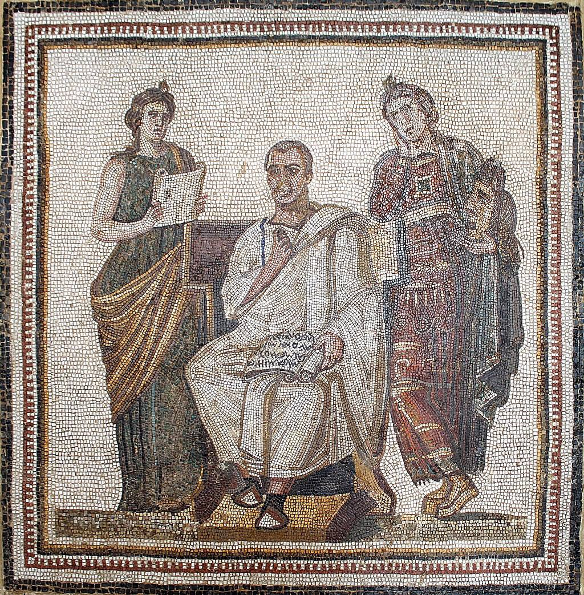

# Между криминатистикой и мифологией

*(Если вы хотите сразу перейти к списку статей, нажмите [здесь](#toc))*.

Сегодня я, собравшись писать этот текст, очень кстати прочитал на одном из Телеграм-каналов фразу, приписываемую Бернардо Бертолуччи:

> Истории я предпочитаю мифологию, потому что история начинается с правды и приходит к обману, а мифология начинается с обмана и идёт к правде.

Дело не только в этом. Знания о прошлом порой так ошеломляющи, что обыденное сознание отказывается их воспринимать как что-то объективное. Как можно представить себе, например, страдания и гибель десятков миллионов людей во время
мировых войн XX века, если даже операция по удалению апендицита в мирное время воспринимается как
немалая беда? Или, напротив, как осознать молниеносный путь научно-технического прогресса,
если даже на моей памяти люди носили воду ведрами из колодца и обогревались зимой дровами, а в наши дни, спустя каких-то 40 лет, «умные дома» берут на себя большую часть бытовых забот, и это уже не экзотика даже в провинции? Все это действительно удобнее воспринимать в форме художественных фильмов, таких, как «Двадцатый век» [вышеупомянутого итальянского кинорежиссера](https://w.wiki/7zzs), или романов вроде «Войны и мира», чем сухих монографий и малопонятных источников.

С другой стороны, «настоящую правду» о прошлом людям знать, все-таки, хочется, особенно в той части, которая 
касается их семей, местности проживания, этноса, к которому они себя относят. Начав интересоваться такими частными
аспектами истории, они из любителей послушать интересные «сказки» превращаются в следователей-криминалистов, и часто приходят к выводам о том, что «миром правят тайные правительства», «от нас многое скрывают», «все тут шито белыми нитками» и т.д. Красивые мифы от соприкосновения с противоречивыми историческими фактами превращаются в уголовные дела. Кто-то в такие моменты в страхе идет на попятную и возврашаются в мир грез, кто-то начинает с пеной у рта «рубить правду-матку», кто-то, вроде меня, понимает, что история в принципе познаваема, но неисчерпаема силами частного исследователя. Но есть и те, кто не просто прекрасно знает, «как было на самом деле», но и формирует нынешние  исторические события. Знает, да не проболтается. История в руках сильных мира сего похожа на ядерный реактор: если подавать топливо слишком активно, произойдет взрыв и начнется неконтролируемый хаос. А «хаос» должен быть управляемым, поэтому перестановка
акцентов в исторических знаниях производится довольно плавно, чего нельзя не заметить хотя бы по контенту нынешних Youtube-каналов (а люди моего поколения не забыли еще и эпоху Перестройки и Гласности, когда идеология за несколько лет была прямо-таки перевернута с ног на голову, точнее с головы, на которой она стояла 70 лет, обратно в нормальное положение).

Да, в том, что мир управляется из единого центра сегодня мало кто сомневается, несмотря на все усилия идеологов 
выставить такие подозрения как что-то неприличное, мол, «как не стыдно верить в теории заговора?». Да какой же это заговор, если «уши» централизованно принимаемых решений «торчат» уже так сильно, что даже школьники младших классов 
скоро с уверенностью будут показывать на них пальцем: король-то голый!. Одна эпидемия ковида чего стоит. Весь вопрос в том, стоит ли этот «заговор» порицать и разоблачать? 

Во все времена были могущественные люди и организации, которые не афишировали свою деятельность, потому что им было что скрывать. Что в этом... <чуть не сказал криминального> удивительного? Под благовидными предлогами они начинают и заканчивают войны, хищнически добывают природные ресурсы, перераспределяют материальные блага в людских сообществах, порой очень болезненными способами. Я не говорил бы об этом с уверенностью, если бы не видел своими глазами, как в середине 1990-х в России формировались команды политтехнологов, задачей которых было с помощью разнообразных манипуляций «выигрывать» выборы в пользу заранее назначенных кандидатов. Изрядно поработав в пресс-службах и редакциях, я не понаслышке знаю, что официально озвучиваемая версия событий (а именно она чаще всего и превращается в «историческое знание») и малоприятные обстоятельства, которые действительно привели к тем или иным последствиям - это порой вообще не пересекающиеся вселенные. Узнать о реальной подоплеке событий непросто: какие-то материалы труднодоступны, какие-то и вовсе засекречены. Мои самые сокровенные исторические знания почерпнуты из книг, изданных тиражами 1000 экземпляров и меньше.

Что же делать, расслабиться и довериться мифам, раз уж «докопаться до правды» так затруднительно?
Это уж каждый сам выбирает. Мне, например, больше нравится критический подход: поиск неувязок в источниках и трудах историков можно назвать «гимнастикой ума» с не меньшим основанием, чем математику. В этом смысле я положительно отношусь к работам так называемых «альтернативщиков» - современных энтузиастов, изучающих пласты истории, до которых у официальной науки, почему-то, все никак руки не дойдут правда. Правда, некоторых из них я уважаю лишь до тех пор, пока такие исследователи не начинают подменять «шитую белыми нитками официальную версию истории» собственным враньем. По-моему, выдвигать, или, как минимум, публиковать экзотические реконструкции событий сейчас преждевременно. Еще не накопилось достаточно фактов, надежно опровергающих официальную версию истории.

Вот такие-то мои упражнения и собраны на этом сайте. Их ценность, надеюсь, будет заключаться в том, что, 
практикуясь вместе со мной в критическом анализе исторических фактов, кто-нибудь из читателей, возможно, 
не попадет в очередной идеологический капкан, каковые в изобилии расставленных вокруг нас интриганами всех мастей. С помощью критического отношения к прошлому можно даже в какой-то степени предсказать
поведение правящей верхушки, поскольку, например, события двух современных войн очень уж
напоминают по месту проведения и характеру противостояния сторон то, что происходило в XII в. (крестовые походы на Ближнем Востоке и военизированное продвижение на восток в степях между Днепром и Доном).

История познаваема. Она не недоступна, она *труднодоступна*. Изучите, например, средневековый диалект итальянского языка, проанализируйте рукописи, хранящиеся в Лондонской библиотеке, и вуаля - вы сможете сформулировать очень неординарные и  толковые мысли по поводу распространения норманского влияния в Европе. Возможно, вам даже удастся  опровергнуть общепринятые представления о возникновении Киевской Руси. Но кто же пожертвует таким количеством личного времени и  материальных средств? Разве что, потомственный британский аристократ Джон Норвич, которому отец привил в детстве интерес к итальянской культуре. К сожалению, исследовать сколь-нибудь серьезную историческую тему, прочитав несколько книг в метро по дороге на работу, невозможно. Увлечение историей требует самоотдачи и жертв не только от исследователя, но и от его семьи. Мне в этом смысле повезло. Повезло и в том, что историей я занимаюсь к эпоху компьютерных сетей, когда независимые историки легко могут делиться своими наблюдениями размышлениями и выводами. Обмениваясь этой информацией и накапливая ее с помощью современных технических средств, можно будет в конце-концов составить о прошлом корпус знаний более объективных, чем тот, что предлагает сегодня официальная наука. И это действительно происходит у нас на глазах.

# <a name="toc">Список статей</a>

* [Шапка земли греческой](/articles/shapka-zemli-grecheskoy)
* [Неистовый Русланд](/articles/neistoviy-rusland)
* [Конный гладиатор](/articles/konnyj-gladiator)
* [Одним махом семерых протыкахом](/articles/odnim-mahom-semeryh-protykahom)
* [What the щит?](/articles/what-the-schit)
* [Дело пахнет кирасиром](/articles/delo-pahnet-kirasirom)
* [Забористые забрала](/articles/zaboristye-zabrala)
* [Пифагоровы штаны с начёсом](/articles/pifagorovy-shtany-s-nachesom)
* [Смеяться после слова «лопата»](/articles/lopata)
* [А шапочка, извините, откуда?](/articles/a-shapochka-izvinite-otkuda)
* [Треуголки и балаболки](/articles/treugolki-i-balabolki)
* [На поле древней битвы нет ни копий, ни костей](/articles/na-pole-drevnej-bitvy-net-ni-kopij-ni-kostej)
* [Павка Корчагин и оливковое масло](/articles/pavka-korchagin-i-olivkovoe-maslo)
* [Илья Муромец и Калигула](/articles/il-ja-muromets-i-kaligula)
* [На горах валдайских ходил Аполлон](/articles/na-gorah-valdajskih-hodil-apollon)
* [Гусли и хоккей](/articles/gusli-i-hokkej)
* [Хорваты и хороводы](/articles/horvaty-i-horovody)
* [Дядя Гера, Панч и барон Врангель](/articles/djadja-gera-panch-i-baron-vrangel-)
* [(Ана)хроники Вильяма Шекспира](/articles/ana-hroniki-vil-jama-shekspira)
* [(Ана)хроники Вильяма Шекспира (продолжение)](/articles/ana-hroniki-vil-jama-shekspira-prodolzhenie)
* [Юлий Цезарь и канцелярские принадлежности](/articles/julij-tsezar-i-kantseljarskie-prinadlezhnosti)
* [Александр Македонский, Робинзон Крузо и “неправильные пчелы”](/articles/aleksandr-makedonskij-robinzon-kruzo-i-nepravil-nye-pchely)
* [Битва Фридриха Барбароссы с половцами](/articles/bitva-fridriha-barbarossy-s-polovtsami)
* [Битва Тарквиния с Редедей](/articles/bitva-tarkvinija-s-rededej)
* [Беросс как гвоздь официальной хронологии](/articles/beross-kak-gvozd-ofitsial-noj-hronologii)
* [Из истории идолищ поганых](/articles/iz-istorii-idolisch-poganyh)
* [“Его принес сюда ледник!” (С)](/articles/-ego-prines-sjuda-lednik-s-)
* [Итальянцы, бегемоты и татаро-монгольское иго](/articles/ital-jantsy-begemoty-i-tataro-mongol-skoe-igo)
* [Мышкующий Достоевский](/articles/myshkujuschij-dostoevskij)
* [Лукан и лукавство](/articles/lukan-i-lukavstvo)
* [Квадратно-гнездовая христианизция](/articles/kvadratno-gnezdovaja-hristianiztsija-istoricheskaja-ugadajka-vypusk-4-)
* [Убивалленштейн и Божья благодать](/articles/ubivallenshtejn-i-bozh-ja-blagodat)
* [Случай на Белоозере (историческая угадайка, выпуск 3)](/articles/sluchaj-na-beloozere-istoricheskaja-ugadajka-vypusk-3-)
* [Пошто-ж вы, ироды, слоняток замордовалы?](/articles/rossija-rodina-slonov)
* [Чудеса, чудеса, небывальщина](/articles/chudesa-chudesa-nebyval-schina)
* [У императора Нерона в гостиной жили два барона](/articles/u-imperatora-nerona-v-gostinoj-zhili-dva-barona)
* [Из-за леса, из-за гор показал мужик копьё](/articles/iz-za-lesa-iz-za-gor-pokazal-muzhik-kop-e)
* [Отыскался след копьетрясов!](/articles/otyskalsja-sled-kop-etrjasov-)
* […а осадочек остался](/articles/a-osadochek-ostalsja-1)
* […и остаточек остался](/articles/a-osadochek-ostalsja-2)
* [Лихорадка античного вечера](/articles/lihoradka-antichnogo-vechera)
* [Жили в лесу, молились колесу](/articles/zhili-v-lesu-molilis-kolesu)
* [Ох уж эти сказочки, ох уж эти сказочники!](/articles/oh-uzh-eti-skazochki-oh-uzh-eti-skazochniki-)
* [Сука любовь](/articles/suka-ljubov)
* [Манипулирование манипулами и мануфактурами](/articles/manipulirovanie-manipulami-i-manufakturami)
* [Занимательное ословедение](/articles/zanimatel-noe-oslovedenie)
* [Гай Юлий Кейнсарь](/articles/gaj-julij-kejnsar-)
* [Монета Moneta](/articles/moneta-moneta)
* […дык ёлы-палы, здравствуй, сестра!](/articles/-dyk-ely-paly-zdravstvuj-sestra-)

<!--
* [Здесь были Жора, Вася и Бурнашев](/articles/zdes-byli-zhora-vasja-i-burnashev)
* [Не Булгаков? К вам!](/articles/ne-bulgakov-k-vam-)
* [Дело было под Тулой](/articles/delo-bylo-pod-tuloj)
* [Письмо Булгакова Платонову](/articles/pis-mo-bulgakova-platonovu)
* [Остап Бендер на Гражданской войне](/articles/ostap-bender-na-grazhdanskoj-vojne)
* [А что это такое бумкнуло?](/articles/a-chto-eto-takoe-bumknulo-)
* [Метастазы античности](/articles/metastazy-antichnosti)
* [Кто сказал, что Волга впадает в Каспийское море?](/articles/kto-skazal-chto-volga-vpadaet-v-kaspijskoe-more-)
* [Иван кивает на Петра, а Пётр на Ивана](/articles/ivan-kivaet-na-petra-a-petr-na-ivana)
* [Илейка Муромец прокладывает путь на запад](/articles/ilejka-muromets-prokladyvaet-put-na-zapad)
* [Сквозь Кремль](/articles/skvoz-kreml-)
* [Солянка, Лубянка, Таганка, Полянка и другие московские улицы](/articles/soljanka-lubjanka-taganka-poljanka-i-drugie-moskovskie-ulitsy)
* [Шоссе энтузиастов. Следующая станция — Владимирский централ](/articles/shosse-entuziastov-sledujuschaja-stantsija-vladimirskij-tsentral)
* [Анамиты и московиты](/articles/anamity-i-moskovity)
* [Дополнительные подтверждения гипотезы о тождестве Ярославля и летописного Новгорода](/articles/dopolnitel-nye-podtverzhdenija-gipotezy-o-tozhdestve-jaroslavlja-i-letopisnogo-novgoroda)
* [Сорок признаков того, что Ярославль это Новгород](/articles/sorok-priznakov-togo-chto-jaroslavl-eto-novgorod)
* [Под небом голубым был город золотой](/articles/pod-nebom-golubym-byl-gorod-zolotoj)
* [Жены без титек и другие предки славян](/articles/zheny-bez-titek-i-drugie-predki-slavjan)
* [Он лютеран любил богослуженье](/articles/on-ljuteran-ljubil-bogosluzhen-e)
* [Как русский царь на Бреславском шляхе безобразничал](/articles/kak-russkij-tsar-na-breslavskom-shljahe-bezobraznichal)
* [Великий шелковый зихер](/articles/velikij-shelkovyj-ziher)
* [Василий Корчмин: инженер, разведчик, остров](/articles/vasilij-korchmin-inzhener-razvedchik-ostrov)
* [Шведский хрен и царская редька](/articles/shvedskij-hren-i-tsarskaja-red-ka)
* [Переславский перископ](/articles/pereslavskij-periskop)
* [Некоторые факты о позднем крепостном праве](/articles/nekotorye-fakty-o-pozdnem-krepostnom-prave)
* [Вадим, пойдем горб продадим](/articles/vadim-pojdem-gorb-prodadim)
* [Центнеры, гектары и Александрия Египетская](/articles/tsentnery-gektary-i-aleksandrija-egipetskaja)
* [Невероятные приключения суздальцев в Новгороде](/articles/neverojatnye-prikljuchenija-suzdal-tsev-v-novgorode)
* [Битва ярославцев с суздальцами](/articles/bitva-jaroslavtsev-s-suzdal-tsami)
* [Илья Муромец и Google Maps](/articles/il-ja-muromets-i-google-maps)
* [За крутыми тянутся берега пологие](/articles/za-krutymi-tjanutsja-berega-pologie)
* [Откуда есть пошли медведи на земле русской и куда подевались](/articles/otkuda-est-poshli-medvedi-na-zemle-russkoj-i-kuda-podevalis-)
* [Немцы и Немезида](/articles/nemtsy-i-nemezida)
* [Сэр Дик Уиттингтон, Сергей Есенин, викинги и котики](/articles/ser-dik-uittington-sergej-esenin-vikingi-i-kotiki)
* [Абырвалг Новерлендский](/articles/abyrvalg-noverlendskij)
* [Железобетонная корона лангобардов](/articles/zhelezobetonnaja-korona-langobardov)
* [Славяне “свои” и “чужие”](/articles/slavjane-svoi-i-chuzhie-)
* [Изяснение названий немецких городов, которые прежде были славянскими](/articles/izjasnenie-nazvanij-nemetskih-gorodov-kotorye-prezhde-byli-slavjanskimi)
* [Между первой и второй перерывчик небольшой](/articles/mezhdu-pervoj-i-vtoroj-pereryvchik-nebol-shoj)
* [Италия не резиновая](/articles/italija-ne-rezinovaja)
* [Готский двор на острове Буяне](/articles/gotskij-dvor-na-ostrove-bujane)
* [Мы строили, строили… А зачем?](/articles/my-stroili-stroili-a-zachem-)
* [Хронологические инъекции](/articles/hronologicheskie-in-ektsii)
* [Карл Маркс и подкустовый выползень. Часть 1](/articles/karl-marks-i-podkustovyj-vypolzen-chast-1)
* [Узбеки в мореплавании](/articles/uzbeki-v-moreplavanii)
* [Жоашен дю Белле — поэт-руинист](/articles/zhoashen-dju-belle-poet-ruinist)
* [Историческая шрапнель](/articles/istoricheskaja-shrapnel-)
* [Древнегреческая смоковница](/articles/drevnegrecheskaja-smokovnitsa)
* [Источники-заточники](/articles/istochniki-zatochniki)
* [Волшебник недоучка](/articles/volshebnik-nedouchka)
* [Горят-шумят Бадаевские склады](/articles/gorjat-shumjat-badaevskie-sklady)
* [Праздник непослушания](/articles/prazdnik-neposlushanija)
* [Если топну я ногою, позову своих солдат…](/articles/esli-topnu-ja-nogoju-pozovu-svoih-soldat-)
* [Навеки с русским народом, или Мы тут у вас посидим немного, пока зихер не утихнет](/articles/naveki-s-russkim-narodom-ili-my-tut-u-vas-posidim-nemnogo-poka-ziher-ne-utihnet)
* [Колоссы, колосья и Барбарики](/articles/kolossy-kolos-ja-i-barbariki)
* [Астерикс, Обеликс и хронический анахроникс](/articles/asteriks-obeliks-i-hronicheskij-anahroniks)
* [О разорении Рязани (историческая угадайка, выпуск 5)](/articles/o-razorenii-rjazani-istoricheskaja-ugadajka-vypusk-5-)
* [Рыжий рыжего спросил: чем ты бороду красил?](/articles/ryzhij-ryzhego-sprosil-chem-ty-borodu-krasil-)
* [Балкон как моветон](/articles/balkon-kak-moveton)
* [Историческая угадайка. Выпуск 1](/articles/istoricheskaja-ugadajka-vypusk-1)
* [М. Т. Каченовский: альтернативщик XIX века](/articles/m-t-kachenovskij-al-ternativschik-xix-veka)
* [1492 год как начало новой эры](/articles/1492-god-kak-nachalo-novoj-ery)
* [ДВЦ рабочих и крестьян](/articles/dvts-rabochih-i-krest-jan)
* [Зерновой триллер длиной в 1000 лет](/articles/zernovoj-triller-dlinoj-v-1000-let)
* [Град Китеж как экологическая катастрофа](/articles/grad-kitezh-kak-ekologicheskaja-katastrofa)
* [Русские и рыцари](/articles/russkie-i-rytsari)
* [Загадочный город Пордугодев](/articles/zagadochnyj-gorod-pordugodev)
* [На их стороне каналы](/articles/na-ih-storone-kanaly)
* [“…и испортила ему всю ссылку”](/articles/-i-isportila-emu-vsju-ssylku-)
* [Ты их в окно — они в калитку](/articles/ty-ih-v-okno-oni-v-kalitku)
* [Зачем он вообще нужен, этот Новгород?](/articles/zachem-on-voobsche-nuzhen-etot-novgorod-)
-->

<!-- 
* [Old school сводит скулы](/articles/old-school-svodit-skuly)
* [Великий Новгород: фактория или форпост?](/articles/velikij-novgorod-faktorija-ili-forpost-)
* [Побузил, посидел, написал, возглавил](/articles/pobuzil-posidel-napisal-vozglavil)
* [Витрувий in vitro](/articles/vitruvij-in-vitro)
* [Исторический Prolog](/articles/istoricheskij-prolog)
-->

<!-- 
* [Warum die Mädchen lieben die Soldaten? Darum nicht Popularen! Optimaten!](/articles/warum-die-mädchen-lieben-die-soldaten-darum-nicht-popularen-optimaten-) 
* [Домен Рыжебородых: германооптиматы и норманнопопуляры](/articles/domen-ryzheborodyh-germanooptimaty-i-normannopopuljary)
* [Домен Рыжебородых: сало як сало](/articles/domen-ryzheborodyh-salo-jak-salo)
* [Домен Рыжебородых: папа может, папа может](/articles/domen-ryzheborodyh-papa-mozhet-papa-mozhet)
* [Домен Рыжебородых: тысяча мелочей, контейнер №1](/articles/domen-ryzheborodyh-tysjacha-melochej-kontejner-1)
* [Домен Рыжебородых: общество нормано-германской дружбы](/articles/domen-ryzheborodyh-obschestvo-normano-germanskoj-druzhby)
* [Домен Рыжебородых: Цезарь и Спрут](/articles/domen-ryzheborodyh-tsezar-i-sprut)
* [Домен Рыжебородых: мафия бессмертна](/articles/domen-ryzheborodyh-mafija-bessmertna)
* [Домен Рыжебородых: сицилианская защита](/articles/domen-ryzheborodyh-sitsilianskaja-zaschita)
* [Домен Рыжебородых: если папа не разрешает](/articles/domen-ryzheborodyh-esli-papa-ne-razreshaet)
* [Домен Рыжебородых: что такое “друзья римского народа”](/articles/domen-ryzheborodyh-chto-takoe-druz-ja-rimskogo-naroda-)
* [Домен Рыжебородых: в бой вступает формальная логика](/articles/domen-ryzheborodyh-v-boj-vstupaet-formal-naja-logika)
* [Домен Рыжебородых: привет из 90-х](/articles/domen-ryzheborodyh-privet-iz-90-h)
* [Домен Рыжебородых: альтернативная империя наносит удар](/articles/domen-ryzheborodyh-al-ternativnaja-imperija-nanosit-udar)
* [Домен Рыжебородых: “дикие дивизии” римских императоров](/articles/domen-ryzheborodyh-dikie-divizii-rimskih-imperatorov)
* [Домен Рыжебородых: памятка латифундисту](/articles/domen-ryzheborodyh-pamjatka-latifundistu)
* [Домен Рыжебородых](/articles/domen-ryzheborodyh) 
-->
