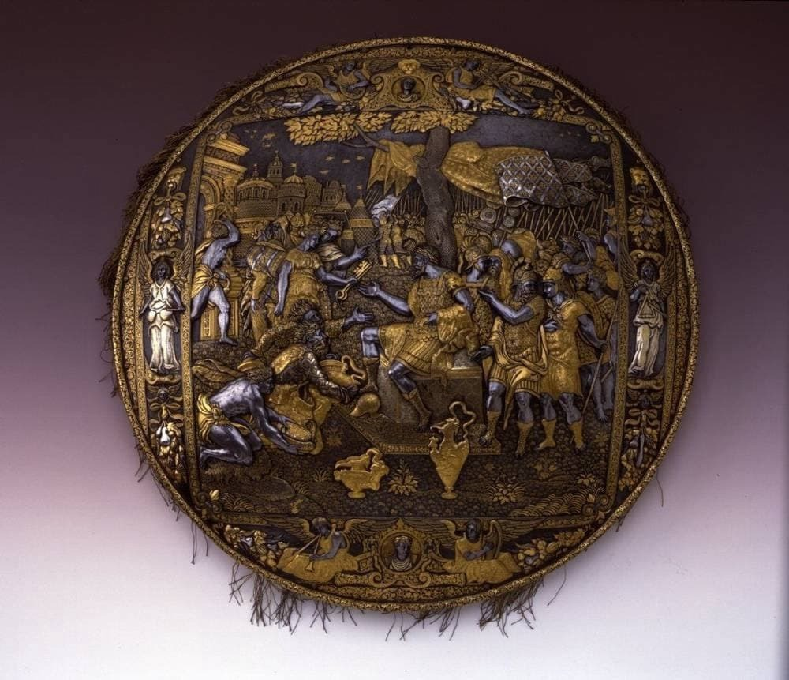
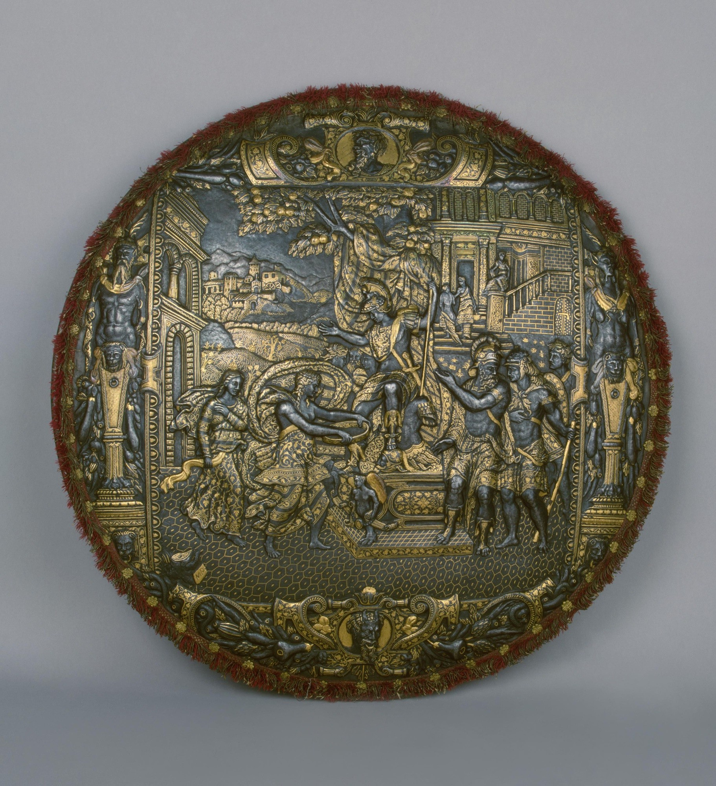
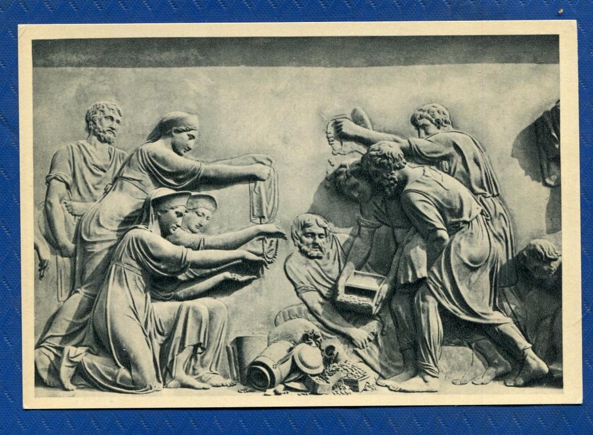

# What the щит?

Посмотрите на этот прекрасный золоченый щит из Милана, изготовление которого приписывают римскому издателю и гравёру Антонио Саламанке. Англоязычный омофон, который обыгрывается в заголовке, относится явно не к этому шедевру.

Подобный предмет вооружений хранится и в Эрмитаже. На него тоже невозможно смотреть без восхищения.

Как не вспомнить [гомеровского описания](https://hojja-nusreddin.livejournal.com/2777724.html) щита, изготовленного Гефестом для Ахиллеса:

> Щит из пяти составил листов и на круге обширном
Множество дивного бог по замыслам творческим сделал.
Там представил он землю, представил и небо, и море,
Солнце, в пути неистомное, полный серебряный месяц,
Все прекрасные звезды, какими венчается небо:
Видны в их сонме Плеяды, Гиады и мощь Ориона,
Арктос, сынами земными еще колесницей зовомый;
Там он всегда обращается, вечно блюдет Ориона
И единый чуждается мыться в волнах Океана.
Там же два града представил он ясноречивых народов:
В первом, прекрасно устроенном, браки и пиршества зрелись.
Там невест из чертогов, светильников ярких при блеске,
Брачных песней при кликах, по стогнам градским провожают.
...
Город другой облежали две сильные рати народов,
Страшно сверкая оружием. Рати двояко грозили:
Или разрушить, иль граждане с ними должны разделиться
Всеми богатствами, сколько цветущий их град заключает.
Те не склонялись еще и готовились к тайной засаде.

Мне не удалось найти подробностей об этих предметах. Известно только, что изготовлены они во второй половине XVII в. в Милане.

На обоих щитах изображены сходные картины: жители завоеванных городов выражают покорность победителям. По крайней мере относительно первого, судя по вручаемым венценосному предводителю изображенного справа воинства ключам и выносимым их ворот богатствам, это не вызывает сомнений. Самый известный случай взятия Милана неприятелем после упорной осады — успех армии Фридриха Барбароссы 1158 г. Кстати, город пал 1 сентября, что хорошо коррелирует с изображенными на втором щите фруктовыми деревьями, усыпанными плодами.

Какие ассоциации вызывают эти изображения? Во-первых, фигуры выполнены в стиле, сильно напоминающем барельефы на памятнике Минину и Пожарскому:

Те же прямоносые женские профили, те же вьющиеся прически и бороды у мужчин, те же реалистичные складки одежды и мускулы. Наши, правда, в штанах, и иногда кажется, что штаны — это и есть единственное, что отличает «Античность» от «Средневековья» и «Нового времени».

Впрочем, нас уверяют, что есть еще один отличительный, очень характерный признак — христианство. И где он? На обоих щитах мы не видим почти ничего связанного с «господствующей религией» «Средневековья». С некоторой натяжкой можно принять за намеки на христианство трубящих ангелов, на первом щите, но крылатых вестников хватало и в античной мифологии. В остальном же рассматриваемые щиты представляют собой чисто античные изображения. На почетных местах в картушах не Христос с Девой Марией, не святые угодники, а какие-то светские лица. На втором же щите и вовсе изображены какие-то черти, вполне довольные собой.

И всё это изготовлено во времена, когда конкистадоры огнем и мечом насаждают христианство в колониях, уже вошла в силу инквизиция, Непобедимая армада отправлена карать протестантов в Англии, по всей Европе из-за вопросов христианской веры разгораются нешуточные страсти, которые вскоре вспыхнут 30-летней войной. Всё это под носом у римского папы. Мода у них, видите ли, на всё античное.

В поисках хронологических аллюзий эти щиты можно рассматривать бесконечно. Я, например, примерил на первом щите изображения львиных морд, напоминающие те, что часто держат кольца на древних воротах (например, суздальских). На втором щите по сторонам изображены какие-то демоны мужского (слева) и женского пола. Не Арес ли это с Афиной, упоминаемые и Гомером в описании щита Ахилла? Возможно, их так принято было изображать изначально? А если это не они, то какая же это «мода на античность», если при изготовлении щита не учитываются гомеровские каноны:

> Стену стеречь по забралам супруг поставив любезных,
Иных сынов и мужей, которых постигнула старость,
Сами выходят; вождями их идут Арей и Паллада,
Оба златые, одетые оба златою одеждой;
Вид их прекрасен, в доспехах величествен, сущие боги!
Всем отличны они; человеки далеко их ниже.

Вместо прекрасных знаменитых античных божеств мы опять видим каких-то безвестных чертей. Получается, это и не Античность, и не Средневековье, и не Возрождение. А что же тогда?

[К оглавлению](/#toc).

[Ссылка на Medium](https://yababay.medium.com/what-the-%D1%89%D0%B8%D1%82-a6098afd435c)
